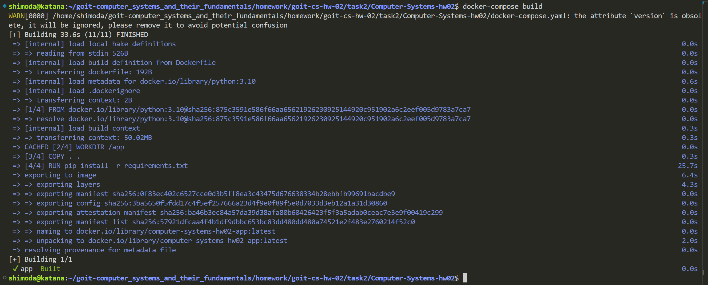
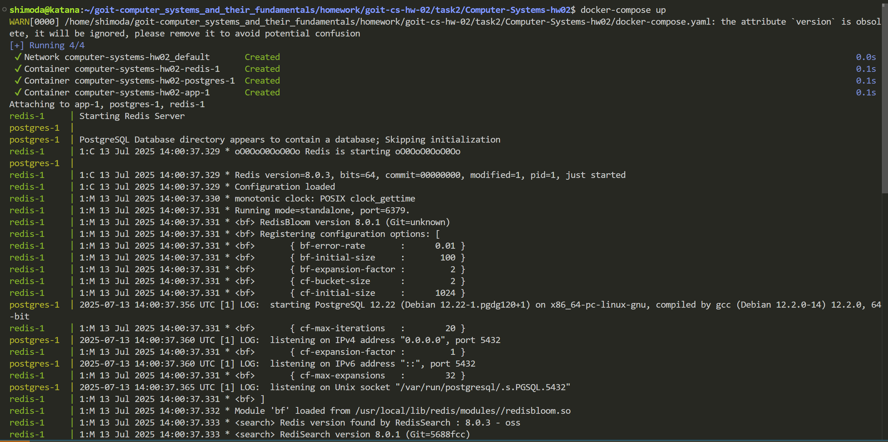
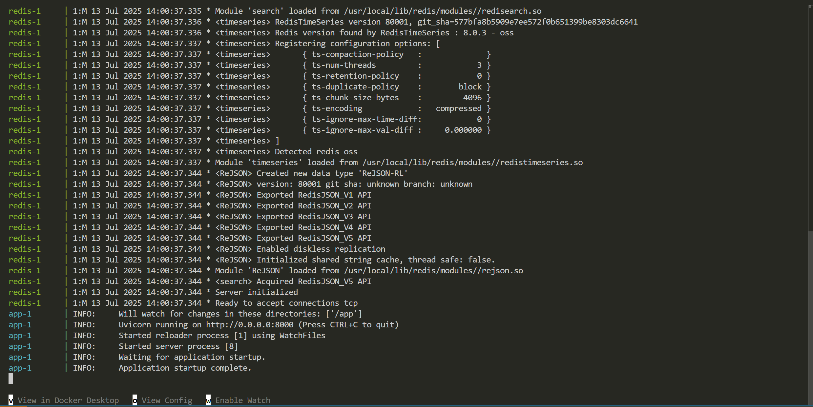
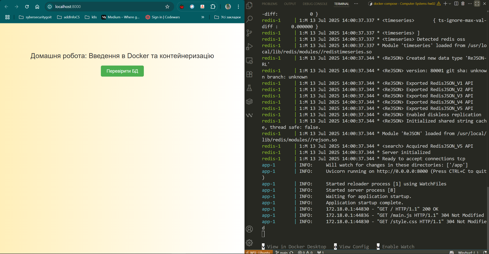
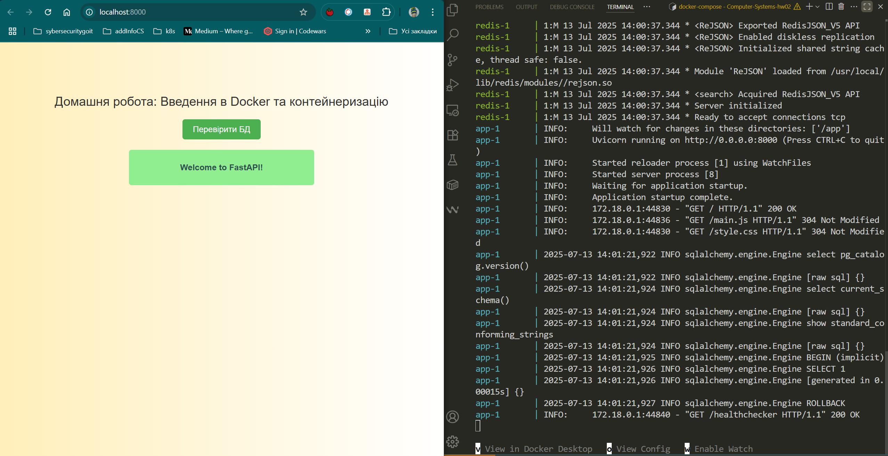
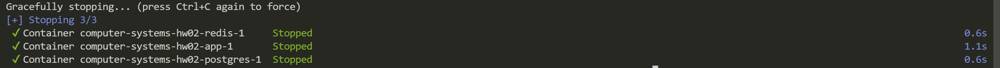
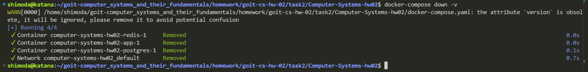

# Як буде працювати додаток

### Поміняй назву файлу env.template.txt  на-->.env у корені додатку, та додайnt до нього слідуючі дані

```
POSTGRES_DB= тут має бути база даних яка створюється при запуску Postgres(за звичай її називають app, rest_app, pstgrs_app  і подібне)
POSTGRES_USER=  ім'я користувача(звичайне юзернейм яке ти обереш)
POSTGRES_PASSWORD= пароль який ти будеш використовувати
POSTGRES_HOST= хост на якому працює Postgres, сервіс у docker-compose.yml
POSTGRES_PORT= порт на якому слухають запит

=FastAPI=
APP_PORT= внутрішній порт на якому відкривається додаток

```

#### якщо буде така помилка:
 - failed to solve: error from sender: open /home/username/way-to/postgres-data: permission denied - це значить ти працюєш в репозиторії який не є твоїм і не склонував його вірно, щоб працювати тобі потрібно виконувати команду 
  ```
    sudo chmod -R 755 ./postgres-data

  ```

#### цю команду треба буде використовувати для зміни прав, щоб програма запрацювала:
```
sudo chown -R $USER:$USER ./postgres-data
```

#### але все рівно це не твоє репо... Спробуй zip-нути і скопіювати потрібні папки.

  ### Реультат роботи Docker:

#### docker-compose build 



#### docker-compose up (1)



#### docker-compose up (2)



  
#### open in browser



#### check in browser



#### stop working



#### docker-compose down -v


